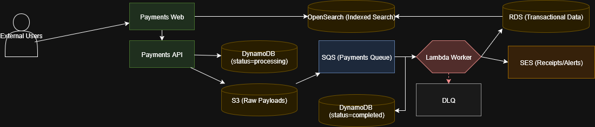

# **Infrastructure Design Scenario**

## Objectives:

_Define a repeatable consistant architecture for the facilitation of a production application as well as defining the neccessary tooling and workflow processes for its deployment_

## The Applications:

- A front-end application
- Varied architectures including a backend API, async handlers, a message bus, and background workers.
  - An assumption of the applications usage being a payments process as well as an email notification service to facilitate some of requirements around the varied architectures.
- An Internal Admin tool only available to the support team.

## The Tools

- **Github Actions**
  - Handles Builds, Tests and Triggers ArgoCD Deployments
- **EKS**
- **ArgoCD**
  - Deployed in the management account
- **Argo Rollouts**
  - Used to facilitate canary deployments

## AWS Accounts and Access Model

The environment will use four AWS accounts under a single AWS Organization:

- **Management Account** – centralized governance, billing, and global policy enforcement.

- **Test Account** – isolated environment for PR Envs, functional and integration testing and Dev Deploys.

- **Pre-prod Account** – staging environment mirroring production for performance and release validation.

- **Production Account** – isolated, least-privilege environment for live workloads.

This access model provides granular control of user onboarding and offboarding by integrating with IAM Identity Center (AWS SSO) or external identity providers such as Okta. Permission sets can be centrally defined and assigned per account, reducing operational overhead while maintaining strict boundaries.

From the Management Account, global governance is enforced using Service Control Policies (SCPs) and Resource Control Policies (RCPs) to apply baseline security and compliance standards consistently across all accounts.

## AWS Environment Architecture:

### Application Environments

The proposed solution is as follows:

- A VPC with three public and private subnets distributed across multiple Availability Zones.

- External Load Balancer in front of the public subnets for internet-facing services, and Internal Load Balancer in front of the private subnets for internal-only access.

- An EKS cluster deployed only in the private subnets.

- CloudFront used to expose both internal and external applications, providing TLS termination, caching, and global edge distribution for frontend traffic.

- Internal access to applications behind the internal load balancer provided through a VPN (e.g., Tailscale) that connects via a Transit Gateway in the management account.

- A dedicated NAT Gateway per AZ to avoid the single point of failure created by a shared NAT Gateway across all AZs.

- Core managed services: S3, DynamoDB, SQS, OpenSearch, and RDS integrated with the web app and Payments API for persistence, messaging, indexing, and relational workloads.

- All services run in private subnets across three Availability Zones. The NAT Gateways provide controlled outbound internet access for EKS nodes and workloads, while VPC Interface Endpoints (not shown) enable private connectivity to AWS APIs. This design ensures internet-facing services remain isolated and internal systems communicate securely.

- The base AWS account infrastructure is created in terraform and is hosted in a repository that is responsible for the deployment of the shared infrastructre as well as the payments application infrastructure.

- The Payments application infrastructure is created in terraform and lives within the applications repo and is treated as an artifact just like the application that is applied in the infrastructure repository.

### The Management Account

TODO: Add management aws account infra with
IAM Identity center
VPC
EKS
Transit Gateway to access other accounts VPC's
IAM Roles in other accounts for access

## Payments Event Driven Architecture

External users access the system through CloudFront, which serves static assets from S3 and routes dynamic requests to the public ALB. Traffic is then forwarded to the EKS cluster via the public ingress controller, where the Payments Web and Payments API services run.

Internal staff are able to connect over VPN into the internal ALB, which targets the internal ingress controller and exposes the Admin Web tool securely which has access to the payments API and web application.

When a payment is submitted by a user, the Payments API validates the request and records the transaction in DynamoDB (status = processing) with a UUID for idempotency while archiving the raw payload to S3.

An S3 -> SQS -> Lambda pipeline then moves the work into background processing. The Lambda worker (or equivalent EKS worker) consumes messages from SQS, updates DynamoDB to mark the payment as complete, and then persists transactional data into RDS (with read replicas for scale), and indexes the transaction into OpenSearch for fast search and reporting.

If the Lambda Function fails at any point, retry logic is built into the system so the message stays in the queue until re-processed. After max attempts it goes to a DLQ for later replay.

SES handles email notifications such as receipts or alerts.

## The Deployment Process

**
_Build -> Test -> Deploy -> Observe -> Promote_
**

For local development, the developers have the ability to run the application stack locally either using docker or docker compose. Unit and functional tests can run locally against the application.

When a PR is created, a temporary environment spins up with app dependencies and infra dependencies, running integration and E2E tests against that created environment. This allows developers to ability to integrate with other services like the full run of Payments API process without touching upper environments.

Once approved and tested, PRs are queued to merge into main sequentially using a merge queue. Once the merge takes place a deploy occurs to the test environment and the PR env is spun down. Once the application is available smoke and E2E tests run.

If dev tests pass, the build is promoted to pre-prod for smoke, E2E, and performance, and regression testing.

Only after all tests pass and approved, the build is promoted to production. The deployment uses a canary strategy with automated rollback if analysis detects issues based upon specified metrics.

## The Deployment Medium

To faclitate the deployment of the application we are utilizing application helm charts which live alongside the application and are also treated as a versioned object.

When a build and release for the application takes place the helm chart is versioned as well and pushed up to a chart repository (either ECR or Chart Museum).

From there the CI/CD process triggers
