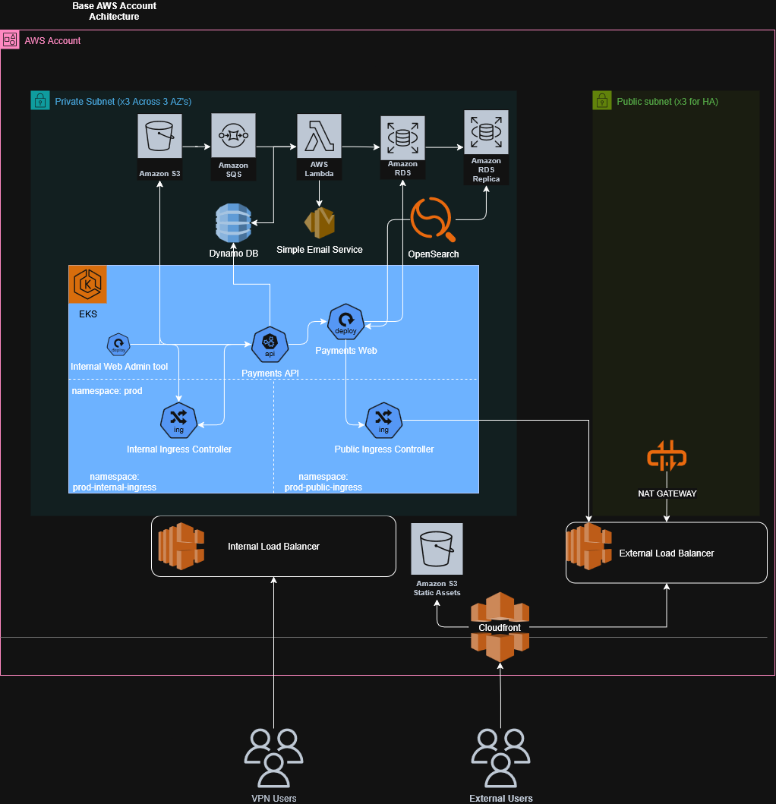
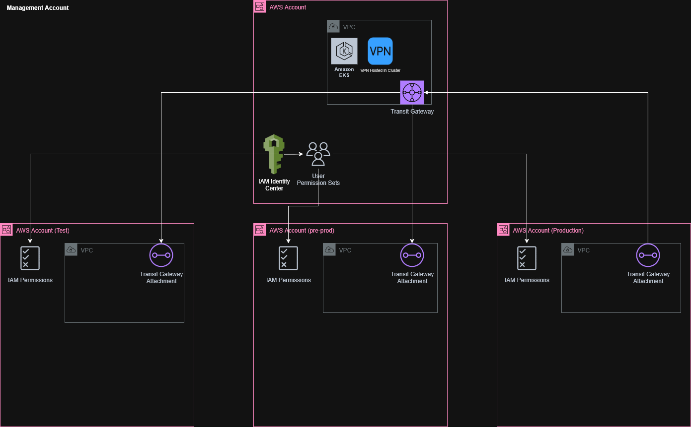
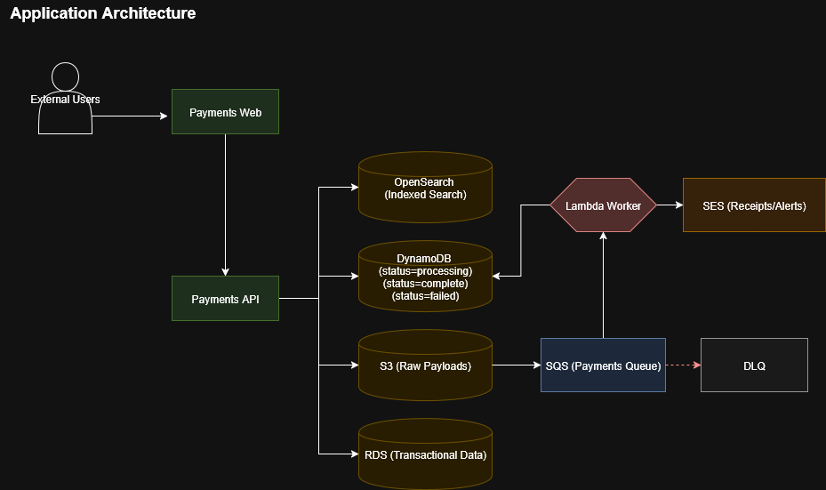
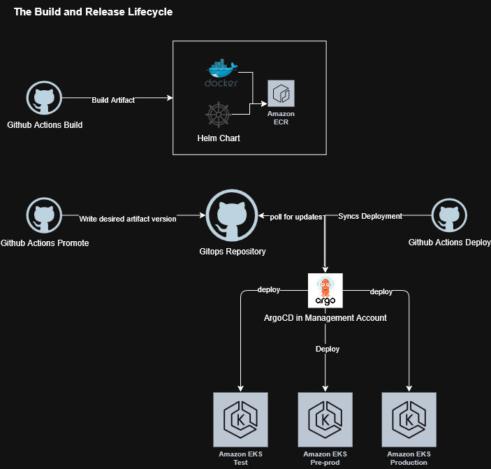

<a name="infrastructure-design-scenario"></a>

# **Infrastructure Design Scenario**

- [Objectives:](#objectives)
- [The Applications:](#the-applications)
- [The Tools](#the-tools)
- [AWS Accounts and Access Model](#aws-accounts-and-access-model)
- [AWS Environment Architecture](#aws-environment-architecture)
  - [Application Environments](#application-environments)
  - [The Management Account](#the-management-account)
- [Application Architecture](#application-architecture)
- [Secrets Management in EKS](#secrets-management-in-eks)
- [The Deployment Process](#the-deployment-process)
- [Deployments With Helm Charts and ArgoCD](#deployments-with-helm-charts-and-argocd)
- [Canary Releases using ArgoCD Rollouts](#canary-releases-using-argocd-rollouts)
- [The Observability Layer](#the-observability-layer)

<a name="objectives"></a>

## Objective

_Define a repeatable consistant architecture for the facilitation of a production application as well as defining the neccessary tooling and workflow processes for its successful deployment_

<a name="the-applications"></a>

## The Applications

- A front-end application
- Varied architectures including a backend API, async handlers, a message bus, and background workers.
  - An assumption of the applications usage being a payments process as well as an email notification service to facilitate some of requirements around the varied architectures.
- An Internal Admin tool only available to the support team.

<a name="the-tools"></a>

## The Tools

- **Github Actions**
  - Handles Builds, Tests and Triggers ArgoCD Deployments
- **EKS**
- **ArgoCD**
  - Deployed in the management account
- **Argo Rollouts**
  - Used to facilitate canary deployments

<a name="aws-accounts-and-access-model"></a>

## AWS Accounts and Access Model


The environment will use four AWS accounts under a single AWS Organization:

- **Management Account** – centralized governance, billing, and global policy enforcement.

- **Test Account** – isolated environment for PR Envs, functional and integration testing and Dev Deploys.

- **Pre-prod Account** – staging environment mirroring production for performance and release validation.

- **Production Account** – isolated, least-privilege environment for live workloads.

This access model provides granular control of user onboarding and offboarding by integrating with IAM Identity Center (AWS SSO) or external identity providers such as Okta. Permission sets can be centrally defined and assigned per account, reducing operational overhead while maintaining strict boundaries.

From the Management Account, global governance is enforced using Service Control Policies (SCPs) and Resource Control Policies (RCPs) to apply baseline security and compliance standards consistently across all accounts.

<a name="aws-environment-architecture"></a>

## AWS Environment

A secure, multi-account AWS architecture with management and application accounts. The management account provides centralized identity, governance, and shared networking via Transit Gateway and VPN, while application accounts host EKS workloads, isolated load balancers, CloudFront distribution, and core managed services, all provisioned through Terraform.

<a name="application-environments"></a>

### Application Environments



The proposed solution is as follows:

- A VPC with three public and private subnets distributed across multiple Availability Zones.

- External Load Balancer in front of the public subnets for internet-facing services, and Internal Load Balancer in front of the private subnets for internal-only access.

- An EKS cluster deployed only in the private subnets.

- CloudFront used to expose both internal and external applications, providing TLS termination, caching, and global edge distribution for frontend traffic.

- Internal access to applications behind the internal load balancer provided through a VPN (e.g., Tailscale) that connects via a Transit Gateway from the management account.

- A dedicated NAT Gateway per AZ to avoid the single point of failure created by a shared NAT Gateway across all AZs.

- Core managed services: S3, DynamoDB, SQS, OpenSearch, and RDS integrated with the web app and Payments API for persistence, messaging, indexing, and relational workloads.

- All services run in private subnets across three Availability Zones. The NAT Gateways provide controlled outbound internet access for EKS nodes and workloads, while VPC Interface Endpoints enable private connectivity to AWS APIs. This design ensures internet-facing services remain isolated and internal systems communicate securely.

- The base AWS account infrastructure is created in terraform and is hosted in a repository that is responsible for the deployment of the shared infrastructre as well as the payments application infrastructure.

- The Payments application infrastructure is created in terraform and lives within the applications repo and is treated as an artifact just like the application that is applied in the infrastructure repository.

<a name="the-management-account"></a>

### The Management Account



The management account hosts core shared infrastructure, including IAM Identity Center for centralized authentication and permission set management, a dedicated VPC with an EKS cluster and a hosted VPN for access for internal tools using a Transit Gateway to provide secure connectivity to VPCs in the test, pre-prod, and production accounts.

Cross-account IAM roles in each workload account will be used for delegated access, ensuring centralized governance and streamlined user lifecycle management across the organization.

<a name="application-architecture"></a>

## Application Architecture



External users access the system through CloudFront, which serves static assets from S3 and routes dynamic requests to the public ALB. Traffic is then forwarded to the EKS cluster via the public ingress controller, where the Payments Web and Payments API services run.

Internal staff are able to connect over VPN into the internal ALB, which targets the internal ingress controller and exposes the Admin Web tool securely which has access to the payments API and web application.

When a payment is submitted by a user, the Payments API validates the request and records the transaction in DynamoDB (`status = processing`) with a UUID for idempotency while archiving the raw payload to S3.

An `S3 -> SQS -> Lambda` pipeline then moves the work into background processing. The Lambda worker (or equivalent EKS worker) consumes messages from SQS, updates DynamoDB to mark the payment as complete, and then persists transactional data into RDS (with read replicas for scale), and indexes the transaction into OpenSearch for fast search and reporting.

If the Lambda Function fails at any point, retry logic is built into the system so the message stays in the queue until re-processed. After max attempts it goes to a DLQ for later replay.

SES handles email notifications such as receipts or alerts.

<a name="secrets-management-in-eks"></a>

## Secrets Management in EKS


All secrets will be stored in repository using [SOPS](https://github.com/getsops/sops) using [AWS KMS keys](https://github.com/getsops/sops?tab=readme-ov-file#using-sops-yaml-conf-to-select-kms-pgp-and-age-for-new-files) per environment. The secrets are created in terraform and then added to secrets manager or parameter store. Only Admin accounts will be able to decrypt and add SOPS secrets for production.

The [External Secrets Operator](https://external-secrets.io/latest/provider/aws-secrets-manager/) connects Kubernetes to AWS Secrets Manager or SSM Parameter Store through IAM Roles for Service Accounts (IRSA).

A ClusterSecretStore resource defines the AWS provider, and ExternalSecret resources specify which secrets to fetch. The operator retrieves the values securely using the IAM role and syncs them into native Kubernetes Secrets.

Applications then consume these secrets through environment variables or mounted volumes without needing direct AWS credentials. Whenever the underlying secret is updated in AWS, the operator automatically refreshes the Kubernetes Secret on its configured sync interval, ensuring applications always use the latest values while keeping sensitive data managed centrally in AWS.

Database credentials as well as external payments provider API's will be stored and pulled down from Secrets Manager and consumed by the application.

<a name="the-deployment-process"></a>

## The Deployment Process

**<center>_Build -> Test -> Deploy -> Observe -> Promote_</center>**


For local development, the developers have the ability to run the application stack locally either using docker or docker compose. Unit and functional tests can run locally against the application.

When a PR is created, a temporary environment spins up with app dependencies and infra dependencies, running integration and E2E tests against that created environment. This allows developers to ability to integrate with other services like the full run of Payments API process without touching upper environments.

Once approved and tested, PRs are queued to merge into main sequentially using a merge queue. Once the merge takes place a deploy occurs to the test environment and the PR env is spun down. Once the application is available smoke and E2E tests run.

If dev tests pass, the build is promoted to pre-prod for smoke, E2E, and performance, and regression testing.

Only after all tests pass and approved, the build is promoted to production. The deployment uses a canary strategy with automated rollback if analysis detects issues based upon specified metrics.

<a name="deployments-with-helm-charts-and-argocd"></a>

## Deployments With Helm Charts and ArgoCD

<center></center>

To faclitate the deployment of the application we are utilizing application helm charts which live alongside the application and are also treated as a versioned and released object.

When a build and release for the application takes place, the helm chart is versioned and released as well and pushed up to a chart repository (either ECR or Chart Museum, ECR in my examples).

From there the CI/CD process triggers an API call to argocd to deploy the specific version of the built and released helm chart which contains the released application. The deployment targets the specific environment based on where the the deployment process is in the merge queue.

<a name="canary-releases-using-argocd-rollouts"></a>

## Canary Releases using ArgoCD Rollouts


To facilitate a canary release with rollbacks for Production we will utilize ArgoCD Rollouts. Due to the usage of ArgoCD for our deployment mechanism, using rollouts is a logical next step to expand the functionality of `release -> deploy -> observe` to allow for canary deployments during deployments.

```yaml
apiVersion: argoproj.io/v1alpha1
kind: AnalysisTemplate
metadata:
  name: app-dd-slo
spec:
  metrics:
    - name: p95_latency
      interval: 1m
      successCondition: result < 0.35 # requests in seconds of duration
      failureLimit: 1
      provider:
        datadog:
          query: |
            avg:trace.http.request.duration{service:app,env:prod}.rollup(p95)
    - name: error_rate
      interval: 1m
      successCondition: result < 0.05 # < 5% errors
      failureLimit: 1
      provider:
        datadog:
          query: |
            sum:trace.http.error{service:app,env:prod}.rollup(sum) /
            sum:trace.http.requests{service:app,env:prod}.rollup(sum)
```

By using the Datadog provider we can monitor the application to only be deployed if that release is fufilling the contract set by latency as well as making sure that error rates are within manageable limits before promoting.

Rollouts can also be expanded to smoke testing for usage in lower environments vs using post sync hooks.

```yaml
apiVersion: argoproj.io/v1alpha1
kind: AnalysisTemplate
metadata:
  name: app-smoke-tests
spec:
  provider:
    job:
      spec:
        template:
          spec:
            restartPolicy: Never
            containers:
              - name: check
                image: curlimages/curl:8
                args: ["-sfS", "http://app-canary.prod.svc/healthz"]
```

<a name="the-observability-layer"></a>

## The Observability Layer
